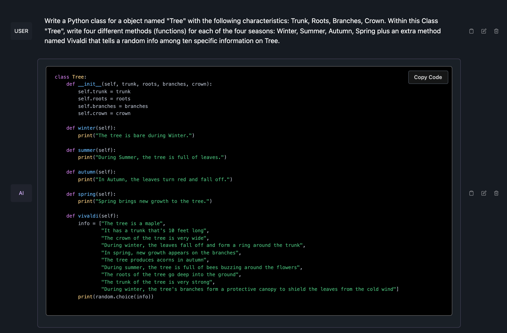

# 001_python_crash_course_eric_matthes


**A set of resources from Books, Exercises, Notebooks to discover and learn Python. It exists both in French and in English.**


**A kind of Reader's Digest or a sort of "best of" book so inevitably sometimes a strong cognitive bias because only a few elements interest me!**


**Intro**
For the purpose of this book, we will stick to one of the most versatile, yet easy-to-learn, languages, Python.

## 1. How-to launch the python scripts in a mac console

Reminder to launch python scripts in the console.


```bash
# 1. open a terminal console on mac

# 2. go to the directory
cd /Users/brunoflaven/Documents/03_git/learning_python_for_all/001_python_for_family
# You will have to change it e.g. cd /[your-path]/001_python_for_family/

# 3. launch the command below in the console 

# check python version
python --version

# Launch the script named "002_python_for_family.py" with the python installed by default
python 002_python_for_family.py

# Launch the script named "002_python_for_family.py" with the python version 3 is installed (old mac)
python3 002_python_for_family.py


# command to launch each python files
python 001_python_for_family.py
python 002_python_for_family.py
python 003_python_for_family.py
python 004_python_for_family.py
python 005a_python_for_family.py
python 005b_python_for_family.py
python 006_python_for_family.py
python 006a_python_for_family.py
python 006b_python_for_family.py
python 006c_python_for_family.py
python 006d_python_for_family.py
python 006e_python_for_family.py
python 006f_python_for_family.py
python 007_python_for_family.py
python 008_python_for_family.py
python 009_0_class_model_face_python_for_family.py
python 009_1_class_dog_python_for_family.py
python 009_2_class_car_python_for_family.py
python 009_2_class_cars_python_for_family.py
python 010_python_for_family_pizza.py
```

## 2. How-to use a Python Class... See it in action
Reminder on how-to use a Python Class.


```bash
# 1. open a terminal console on mac

# 2. See the class in action
python 009_0_class_model_face_python_for_family.py
python 009_1_class_dog_python_for_family.py
python 009_2_class_car_python_for_family.py
python 009_2_class_cars_python_for_family.py


# 3. go to the directory to see another way to manage Python Class
cd 011_usecase_class_car
```

## 2. HOW-TO: think abstraction to create a Python Class

**English Version**
A personal introduction to the concept of Class in Python. Explanation which is also valid for other programming languages such as PHP or JavaScript.
If you need to transpose a “Class” from one programming language to another, for example from Python to PHP, do not hesitate to use LLMs (chatGPT, Mistral, llama2...), they do this very GOOD!

**French Version**
Une introduction personnelle à la notion de Class en Python. Explication qui est aussi valable pour d'autres langages de programmation tel que le PHP ou le JavaScript.
Si vous avez besoin de transposer une "Class" d’un langage de programmation à un autre par exemple du Python vers PHP, n’hésitez pas à recourir à des LLMs (chatGPT, Mistral, llama2...), ils font cela très bien !


**English Version**

A "Class" is trying to understand object-oriented programming. Writing a "Class", in its simplest definition, begins an intellectual process which has only one goal: to abstract an object.

The word "Class" is deliberately written in English and in quotation marks to clearly indicate that we are talking about a "Class" in programming and not a "Class" at school for example.


For example, let's take a tree. How can we describe a tree using objective characteristics? Thinking carefully, we can say that to describe a tree like all trees, we can choose the following characteristics: A tree is described as an Object using several characteristics Trunk, Roots, Branches, Crown, Twigs, Bole.


Thus, all the objects around you can be described using language and therefore using abstraction. You can have fun describing a car, a person, a bear, an oyster, a crab, a stadium, a computer, a city... In short, it is the great strength of the human spirit. For your information, this is a subject that does not only concern IT but goes far beyond this framework. We find this questioning in mathematics of course but even more in philosophy (Wittgenstein, Schopenhauer).


**French Version**

Une "Class", c'est essayer de comprendre la programmation orienté objet. Ecrire une "Class", dans sa plus simple définition, c'est entamé un processus intellectuel qui n'a qu'un but abstraire un objet. 

Le mot "Class" est écrit volontairement en anglais et entre guillemets pour bien signifier que l'on parle d'une "Class" en programmation et non une "Classe" à l'école par exemple.


Par exemple prenons un arbre. Comment peut-on décrire un arbre via des caractéristiques objectives ? En réfléchissant bien, on peut dire que pour décrire un arbre comme tous les arbres, on peut choisir les caractéristiques suivantes : Un arbre se décrit comme Objet à l'aide de plusieurs caractéristiques Tronc, Racines, Branches, Houppier, Rameaux, Fût.


Ainsi, tous les objets qui t'entourent peuvent décrit à l'aide du langage donc à l'aide d'abstraction. Tu peux t'amuser à décrire une voiture, une personne, un ours, une huître, un crabe, un stade, un ordinateur, une ville... Bref, c'est la grande force de l'esprit humain. Pour info, c'est un sujet qui ne concerne pas seulement l'informatique mais dépasse très largement ce cadre. On retrouves ce questionnement en mathématiques bien sûr mais plus encore en philosophie (Wittgenstein, Schopenhauer).


**Words for a tree to create an object for a Pyhton Class**
| **Nb**               | **French**        | **English**      |
| ----------   | ----------| -------------|
| 1 			   | Tronc         |Trunk         |
| 1 			   | Racines       |Roots         |
| 1 			   | Branches      |Branches      |
| 1 			   | Houppier      |Crown         |
| 1 			   | Rameaux       |Shoots        |
| 1 			   | Fût           |Stem          |


**Do I believe google Google translate or a specialist?**

You see also the pb of truth on this single do I trust google or Do i trust a website made by biologist? Who is wrong?

It introduces the notion of post-truth era, who is the curator... Some major concerns for IA and the information on the web in general.


```bash
# BIOLOGIST
# EN: Trunk, Roots, Branches, Crown, Shoots, Stem
# FR: Tronc, Racines, Branches, Houppier, Rameaux, Fût

# GOOGLE
# EN: Trunk, Roots, Branches, Crown, Twigs, Bole
# FR: Tronc, Racines, Branches, Couronne, Pousses, Tige
```

### Make the IA do the job wit Class!

**To see the code in action, check the files: `ia_class_tree_english_1.py`, `ia_class_tree_english_2.py`, `ia_class_tree_french_1.py`, `ia_class_tree_french_2.py`**

#### PROMPT_1  English prompt for IA

```bash
# English prompt for IA
Write a Python class for a object named "Tree" with the following characteristics: Trunk, Roots, Branches, Crown. Within this Class "Tree", write four different methods (functions) for each of the four seasons: Winter, Summer, Autumn, Spring plus an extra method named Vivaldi that tells a random info among ten specific information on Tree.

```

#### ChatGPT answer in English for PROMPT_1
Certainly! Below is a simple Python class named "Tree" with the specified characteristics and methods for each season, along with the extra method named "Vivaldi":

```python
import random

class Tree:
    def __init__(self, trunk, roots, branches, crown):
        self.trunk = trunk
        self.roots = roots
        self.branches = branches
        self.crown = crown

    def winter(self):
        return "In winter, the {} and {} are dormant, and the {} may lose its leaves.".format(self.trunk, self.roots, self.crown)

    def summer(self):
        return "In summer, the {} and {} are flourishing, and the {} is full of leaves.".format(self.trunk, self.roots, self.crown)

    def autumn(self):
        return "In autumn, the {} and {} may display vibrant colors, and the {} may shed its leaves.".format(self.trunk, self.roots, self.crown)

    def spring(self):
        return "In spring, the {} and {} start to bloom, and the {} gets new leaves.".format(self.trunk, self.roots, self.crown)

    def vivaldi(self):
        info_list = [
            "Trees play a crucial role in carbon sequestration.",
            "Certain trees shed their leaves in winter to conserve energy.",
            "Roots anchor the tree and absorb nutrients from the soil.",
            "Branches provide structural support and carry nutrients to the leaves.",
            "The trunk is the main support structure of the tree.",
            "The crown, or canopy, is the upper part of the tree that contains the leaves.",
            "Different tree species have distinct growth patterns and shapes.",
            "Some trees produce fruits and seeds as a means of reproduction.",
            "Trees contribute to biodiversity by providing habitats for various species.",
            "Forests help maintain ecological balance and regulate climate."
        ]
        return random.choice(info_list)

# Example usage:
my_tree = Tree(trunk="thick trunk", roots="extensive root system", branches="wide branches", crown="lush green crown")

print(my_tree.winter())
print(my_tree.summer())
print(my_tree.autumn())
print(my_tree.spring())
print(my_tree.vivaldi())
```

In this example, you can create an instance of the `Tree` class and call the methods corresponding to each season. The `vivaldi` method provides a random piece of information about trees. Feel free to customize the class and the information in the `vivaldi` method as needed.


#### Mistral answer in English for PROMPT_1


The specifications for Mistral are the following:


|**Name**|  **Quant method**|  **Bits**|  **Size**|  **Max RAM required**|  **Use case**|
| ----------   | ----------| -------------| ----------   | ----------| -------------|
mistral-7b-instruct-v0.2.Q2_K.gguf|  Q2_K|  2| 3.08 GB| 5.58 GB| smallest, significant quality loss - not recommended for most purposes|


**System:**

Below is an instruction that describes a task. Write a response that appropriately completes the request.

**User:**

Write a Python class for a object named "Tree" with the following characteristics: Trunk, Roots, Branches, Crown. Within this Class "Tree", write four different methods (functions) for each of the four seasons: Winter, Summer, Autumn, Spring plus an extra method named Vivaldi that tells a random info among ten specific information on Tree.

**Assistant:**

```python
class Tree:
    def __init__(self, trunk, roots, branches, crown):
        self.trunk = trunk
        self.roots = roots
        self.branches = branches
        self.crown = crown
    
    def winter(self):
        print("The tree is bare during Winter.")
    
    def summer(self):
        print("During Summer, the tree is full of leaves.")
    
    def autumn(self):
        print("In Autumn, the leaves turn red and fall off.")
    
    def spring(self):
        print("Spring brings new growth to the tree.")
    
    def vivaldi(self):
        info = ["The tree is a maple",
                "It has a trunk that's 10 feet long",
                "The crown of the tree is very wide",
                "During winter, the leaves fall off and form a ring around the trunk",
                "In spring, new growth appears on the branches",
                "The tree produces acorns in autumn",
                "During summer, the tree is full of bees buzzing around the flowers",
                "The roots of the tree go deep into the ground",
                "The trunk of the tree is very strong",
                "During winter, the tree's branches form a protective canopy to shield the leaves from the cold wind"]
        print(random.choice(info))
```





#### PROMPT_2 French prompt for IA

```bash
# French prompt for IA
Ecrivez une Classe Python pour un objet nommé "Arbre" avec les caractéristiques suivantes : Tronc, Racines, Branches, Couronne. Dans cette Classe Python "Arbre", écrivez quatre méthodes (fonctions) différentes pour chacune des quatre saisons : Hiver, Été, Automne, Printemps plus une méthode supplémentaire nommée Vivaldi qui donne une information aléatoire parmi dix informations spécifiques sur l'Arbre e.g "Arbre".

```
#### ChatGPT answer in French for PROMPT_2

Bien sûr ! Voici une classe Python pour un objet appelé "Arbre" avec les caractéristiques spécifiées, ainsi que des méthodes pour chaque saison et une méthode supplémentaire nommée "Vivaldi" qui fournit une information aléatoire parmi dix informations spécifiques sur l'arbre :

```python
#!/usr/bin/python
# -*- coding: utf-8 -*-


"""
cd /Users/brunoflaven/Documents/03_git/learning_python_for_all/001_python_crash_course_eric_matthes/

python ia_class_tree_french.py

Source: TP_1

"""
import random

class Arbre:
    def __init__(self, tronc, racines, branches, couronne):
        self.tronc = tronc
        self.racines = racines
        self.branches = branches
        self.couronne = couronne

    def hiver(self):
        return "En hiver, le {} et les {} sont en dormance, et la {} peut perdre ses feuilles.".format(self.tronc, self.branches, self.couronne)

    def été(self):
        return "En été, le {}, les {} et les {} prospèrent, et la {} est pleine de feuilles.".format(self.tronc, self.racines, self.branches, self.couronne)

    def automne(self):
        return "En automne, le {} et les {} peuvent afficher des couleurs vibrantes, et la {} peut perdre ses feuilles.".format(self.tronc, self.branches, self.couronne)

    def printemps(self):
        return "Au printemps, le {} et les {} commencent à fleurir, et la {} obtient de nouvelles feuilles.".format(self.tronc, self.branches, self.couronne)

    def vivaldi(self):
        infos = [
            "Les arbres jouent un rôle crucial dans la séquestration du carbone.",
            "Certains arbres perdent leurs feuilles en hiver pour économiser de l'énergie.",
            "Les racines ancrent l'arbre et absorbent les nutriments du sol.",
            "Les branches fournissent un support structurel et transportent les nutriments vers les feuilles.",
            "Le tronc est la structure de support principale de l'arbre.",
            "La couronne, ou le feuillage, est la partie supérieure de l'arbre qui contient les feuilles.",
            "Différentes espèces d'arbres ont des motifs de croissance et des formes distincts.",
            "Certains arbres produisent des fruits et des graines comme moyen de reproduction.",
            "Les arbres contribuent à la biodiversité en fournissant des habitats pour diverses espèces.",
            "Les forêts aident à maintenir l'équilibre écologique et à réguler le climat."
        ]
        return random.choice(infos)

# Exemple d'utilisation :
mon_arbre = Arbre(tronc="tronc épais", racines="système racinaire étendu", branches="branches larges", couronne="couronne verte luxuriante")

print(mon_arbre.hiver())
print(mon_arbre.été())
print(mon_arbre.automne())
print(mon_arbre.printemps())
print(mon_arbre.vivaldi())

```

Vous pouvez créer une instance de la classe `Arbre` et appeler les méthodes correspondant à chaque saison. La méthode `vivaldi` fournit une information aléatoire sur l'arbre. N'hésitez pas à personnaliser la classe et les informations dans la méthode `vivaldi` selon vos besoins.


## 3. HOW-TO: Describe a tree as an object to build a class Named `Tree`
I try to find some words to describe a tree. here is the explanations in French and in English.

**French Version**

```bash
Les conifères sont des plantes souvent arborescentes, constituées d'une tige unique (le tronc) fixée au sol par les racines, qui porte des branches formant le houppier.


Les branches (ou ramifications principales) se divisent à leur tour en rameaux. Généralement, le tronc des arbres adultes (plus de 7 m de haut) n'est chargé de branches et de feuilles qu'à partir d'une hauteur de plusieurs mètres.

La partie dénudée est appelée le fût.

Les arbustes sont des arbres de plus petites dimensions (moins de 7 m), avec un tronc bien différencié, alors que les arbrisseaux (moins de 4 m) sont le plus souvent ramifiés dès la base. Cependant, la taille n'est pas le critère unique qui permet de séparer ces trois catégories de plantes ligneuses.

Tronc
Racines
Branches
Houppier
Rameaux 
Fût

# SOURCE: https://www.kloranebotanical.foundation/la-botanique/lecons-de-botanique/les-differentes-parties-dun-arbre
```

**English Version**


```bash
Conifers are plants that are often tree-like, consisting of a single trunk attached to the ground by roots, and have branches that form a crown.
 
The  branches (or main offshoots) subdivide into smaller shoots. In general, the branches and leaves of a mature tree (more than 7m tall) start several metres above ground.

The part below the branches is called the stem.
 
Shrubs are smaller trees  (less than 7m), with a very branched trunk, and bushes (less than 4m) are usually branched right from ground level. But size is not the only criterion that separates these three categories of woody plants.

Trunk
Roots
Branches
Crown
Shoots 
Stem

# SOURCE: https://www.kloranebotanical.foundation/en/botany/botany-lessons/parts-tree
```

**Other English Ressource to describe Tree as an Object**


```bash
# Other
In the 1990s, a forest ecologist created a mathematical formula for estimating a sequoia's age based on the volume of its bole, or the trunk below the crown.

# https://www.smithsonianmag.com/science-nature/the-science-behind-the-oldest-trees-on-earth-180981372/


# Tree Vocabulary in English | Tree Names | Glossary | Tree Wordlist | Related Words to Trees 🌲🌲 
# https://www.youtube.com/watch?v=rq6gseuvKNc

Oak
Long
Leaf
Acorn
Willow
Elongated
Droopy
Weeping
Sallow
Cherry Blossom
Tradition
Christmas Tree
Norway Spruce
Lifespan
Timber
Lumber
Lumberjack
Logging
Maple Tree
Sap
Maple Syrup
Palm Tree
Cultivate
Palm Oil
Coconut
Forest 
Jungle
Rainforest
Deforestation
Climate Change


```


## 3. HOW-TO: managing python environnement

If you want to manage better manange your work in python (projects, scripts, POC) on your machine. It requires a tool to manage Python in local. I use ANACONDA.

**Note:** Under ANACONDA or other tools (PYTHON-POETRY, VENV), the best is to create different environments because the eventual "libraries" called by the files are not the same.


- Using [ANACONDA](https://www.anaconda.com/)
- Using [PYTHON-POETRY](https://python-poetry.org/)
- Using [VENV](https://docs.python.org/3/library/venv.html)


Here is the command to create an development environment with Anaconda. In my example, the dev environment is called `start_learning_python`

```python

"""
[env]
# Conda Environment
conda create --name start_learning_python python=3.9.13
conda info --envs
source activate start_learning_python
conda deactivate

# if needed to remove
conda env remove -n [NAME_OF_THE_CONDA_ENVIRONMENT]
conda env remove -n start_learning_python

# update conda
conda update -n base -c defaults conda

# to export requirements
pip freeze > requirements.txt

# to install
pip install -r requirements.txt


# or type each command using anaconda
conda install -c anaconda nltk
conda install -c pytorch pytorch
conda install -c anaconda numpy
conda install -c conda-forge gradio
conda install -c conda-forge transformers

# or type each command using with pip
pip install ctransformers

# [path]
cd /Users/brunoflaven/Documents/02_copy/_000_IA_bruno_light/002_learning_python_for_family/001_python_for_family/

# launch the script
python 001_python_for_family.py


"""

```

## 4. Why should you learn programming?


- Programming is more than memorizing syntax and a list of function names. As when learning a foreign language, the more practice you put into it, the more you will get out of it.

- It teaches basic programming concepts using the Python programming language, which is one of the best languages for beginners. It has a gentle learning curve that novices of all ages can master, yet it's also a powerful language used by professional software developers. 

- Python runs on Windows, macOS, Linux, and even the Raspberry Pi, and it's free to download and use.


## 5. Enjoy takeaways any time or things to remember

**This "book" has been written with in mind different sources and obvieously some the takeaways:**

This "book" has been written with in a certain mindset.
I wanted to make the best of some resources so here is the hash-tags list.
It summarize what I called in cooking: takeaways, leftovers, memories that you can summon into your home and enjoy at any time!

- **#PRAGMATISM**
You shall take the pragmatism of al_sweigart (al_sweigart)
- **#VISUAL**
You shall take the visual and chapters idea from English PYTHON BY EXAMPLE (english_book_python_by_example)
- **#SIMPLICITY**
You shall take simplicity from us_book_teenagers (us_book_teenagers)
- **#FUN**
You shall take games and drawing pictures from English and Spanish books
- **#EXPLANATORY**
You shall take explanations from python_crash_course
- **#LIGHTLY**
You shall not do dive too much on explanations but insist on practice like for martial art practitioner


## Book Title: Family Cooking for Python Programming
Cuisine familiale pour la programmation Python
<!-- by yalla_pythonista -->

### CHAP_01 Environnement & Outils

Quoi de plus naturel pour un français de faire l'analogie avec la cuisine, sounds cliché mais dans le sujet qui nous intéresse cela pourrait être utile. Pra ailleurs, se nourrir est un acte essentiel dans la vie de la plupart des humains et que vous soyez colombien, sénégalais, laotien ou américain, vous saurez sans doute à quoi je fais référence lorsque je parle d'ingrédients, de recette, de préparation, de cuisson et de dégustation.

Après tout je fais la cuisine avec mes enfants comme mon père lui-même me l'enseignait par l'exemple. Chaque samedi après le marché, je cuisinais avec lui, sous sa direction, je servais aussi à table alors que lui était aux fourneaux comme on dit. Savoir-faire qu'il tenait de lui-même de sa propre mère.


Ainsi pour apprendre le python, que dois-je prendre au "marché". Quelles sont les ingrédients de base dont j'aurai besoin ?
Par analogie avec une recette de cuisine, on va voir tous les ingrédients et les ustensiles dont on doit disposer (environnement) avant d'exécuter la recette de cuisine (script).


**(i) Réalisons cette première séquence.**


```bash
# 1 - Télécharger python sur https://www.python.org/
# 2 - Quelle version ? Faites votre choix en fonction de votre OS
# 3 - Dans le terminal
# 3.1 Lancer Python dans le terminal
# 3.2 Faire des opérations dans la console
# -addition (7+9) ou 34354353453 + 878978978979879
# -soustraction (12-6) ou 34354353453 - 878978978979879
# -multiplication (3*6) ou 4353453 * 20987979879
# -division (12/2) ou 57432644 / 73979879
# 3.3 Sortir de Python
# -quit() = quitter
# -exit() = sortie
```
**(ii) Let's do this first sequence.**

This code provides instructions in French for downloading Python, choosing the appropriate version for your operating system, and performing basic operations in the Python console. The comments explain each step and substep in English, and I have provided a translation of the comments into English for clarity. The code itself is a set of instructions rather than executable code, and it guides the user through the process of interacting with Python in the terminal.


```bash
# 1 - Download Python from https://www.python.org/
# 2 - Choose the version based on your operating system
# 3 - In the terminal
# 3.1 Launch Python in the terminal
# 3.2 Perform operations in the console
# -addition (7+9) or 34354353453 + 878978978979879
# -subtraction (12-6) or 34354353453 - 878978978979879
# -multiplication (3*6) or 4353453 * 20987979879
# -division (12/2) or 57432644 / 73979879
# 3.3 Exit Python
# -quit() = quit
# -exit() = exit
```

<span style="color:orange;"> 🤯 HEAD-UP_1: BUILT-IN vs CUSTOM</span>

**How to differentiate Python functions built-in and what you can write yourself in Python**


**(i) Python Built-in Functions:**

- **Predefined:**
  - Built-in functions are part of the Python language and are available for use without the need for additional imports.
- **Efficiently Implemented:**
  - Built-in functions are often implemented in C or other highly optimized languages, making them efficient and fast.
- **Widely Used:**
  - Built-in functions are commonly used across different Python programs, providing a consistent and standardized set of functionalities.
- **Diverse Functionalities:**
  - Cover a broad range of operations, from basic arithmetic to advanced string manipulations and data structures.

**(ii) Functions You Can Write Yourself:**

- **Customization:**
  - You have complete control over the functionality and implementation of custom functions, tailoring them to specific requirements.
- **Specific to Your Needs:**
  - Custom functions can be designed to solve domain-specific problems or perform tasks unique to your application.
- **Learning and Practice:**
  - Implementing functions yourself is an excellent way to practice programming concepts, improve your coding skills, and deepen your understanding of algorithms.
- **Integration with Libraries:**
  - You can create functions that seamlessly integrate with external libraries or frameworks, extending the capabilities of your code.

**(iii) Commonalities:**

- **Flexibility:**
  - Both built-in functions and custom functions provide flexibility in solving problems, but the level of control and customization may differ.
- **Modularity:**
  - Both types of functions promote modular code design, allowing you to organize your code into manageable and reusable components.
- **Documentation:**
  - It's good practice to document your custom functions just as you would refer to the official documentation for built-in functions.

**(iv) Considerations:**

- **Performance:**
  - Built-in functions are often optimized for performance, so they might be faster in certain scenarios compared to custom implementations.
- **Readability:**
  - Choosing between built-in and custom functions may depend on code readability, maintainability, and adherence to best practices in the specific context of your project.


### 1 - Montrer un éditeur de texte (type Sublime, VSC)
Montrer que pour écrire texte on utilise Word, pour navigateur sur internet on utilise Chrome et bien pour écrire un programme on utilise un éditeur de code. Il existe de nombreux éditeurs : Sublime Text, Visual Studio Code (VSC)


- Sublime Text - Text Editing, Done Right
https://www.sublimetext.com/

- Visual Studio Code (VSC)
https://code.visualstudio.com/


### 2 - Vérifier la version de python installé sur l'ordinateur

The commands are used to check the version of Python installed on your system. 

This line uses the python command to display the version of the default Python interpreter on your system. The --version flag is used to request and print the Python version.

This line is similar to the previous one but specifically uses the python3 command. On some systems, there might be multiple Python versions installed, and python3 is often used to explicitly refer to Python 3.x, while python might refer to Python 2.x. The --version flag is again used to display the version information.

These commands are useful for quickly checking which version of Python is installed on your system. They provide information about the Python interpreter that will be invoked when you run scripts using the python or python3 command.

```bash

# Check the version of Python using the 'python' command
python --version


# Check the version of Python using the 'python3' command
python3 --version


```

### CHAP_02 Les scripts ou la console

#### - 0 - La console
Quelques commandes qui seront nécessaires pour évoluer dans la console de la même manière qu'au sein d'une brigade, chaque cuisinier sait ce qu'il a à faire individuellement et s'insère au mieux au sein du collectif.

Dans la console, on se trouve dans le "corps" du Mac sans les IHM, on est dans le squelette, sans la chair ni le sang, on est dans le système d'exploitation qui ressemble à LINUX ou à UNIX 

L'aventure intérieure où vous pénétrez dans le corps humain, on y retrouve tous les organes, la "vie" qui pulse dans l'ordinateur notamment les répertoires les fichiers. Il faut être extrêmement prudent car vous pouvez parfois causer des dommages irrémédiables à votre ordinateur. De grands pouvoirs impliquent de grandes responsabilités, imaginez vous comme un chirurgien pratiquant une opération.


These comments provide a brief explanation of each command in the Bash script: 
- `pwd` prints the current working directory, 
- `clear` clears the terminal screen, 
- `ls -l` lists the contents of the current directory in long format, 
- and `cd /path-to-the-directory/` changes the current directory to the specified path.


```bash

# Print the current working directory to the terminal.
pwd

# Clear the terminal screen.
clear

# List the contents of the current directory in long format.
ls -l

# Change the current directory to /path-to-the-directory/.
cd /path-to-the-directory/


```


#### - 1 - Mon premier script
C'est un fichier dans lequel je vais écrire en python des instructions pour permettre à Python de les interpréter et de les exécuter.
Par analogie avec une recette de cuisine, on a vu tous les ingrédients dont on devait disposer désormais on va exécuter la recette de cuisine.

Lancer mon premier script dans le terminal. On dit que l'on execute un script.


```bash
# extrait du répertoire de Arthur et Louise
arthur-script-1.py (script python)
arthur-my-wishlist-for-chrismas-1.doc (doc word)
louise-birthdays-party-friends-346.doc (doc word)
louise-best-quotes-citations.xls (doc. excel)

```


#### - 2 - Le fichier
Le nom de fichier
L'extensition du fichier (.py)


#### - 3 - Quelques instructions sur mon premier script

**3.1 Les commandes natives de Python (print)**

```python
print('This text will be printed')
```


**3.2 Faire un commentaire (comment)**


```python
# Ceci est un commentaire...
This is not a comment...
```

**3.2 Créer une variable**

Imaginons que je veuille ranger ma chambre et plus particulièrement mes étagères, qui sont complètement en désordre. Ce que je vais faire c'est que je vais mettre à, porter de main les choses dont je me sers le plus souvent afin de les retrouver le plus facilement et le plus vite possible pour pouvoir m'en servir.

> **Une variable permet de ranger des choses dont le programme ou le script va se servir.**

**(a) Choisir des noms de variables ?**

Moyennant le respect de quelques règles, nommer des variables c'est comme choisir un pseudo pour vos  personnages dans un jeu ou dans une histoire...

  + **(i)** Les noms de variable ne peuvent contenir que des lettres, des chiffres et des tirets du bas (underscore ou `_`). Ils peuvent commencer par une lettre ou un tiret du bas (underscore ou `_`), mais pas par un chiffre. Par exemple, vous pouvez appeler une variable message_1 mais pas 1_message.
  
  + **(ii)** Les espaces ne sont pas autorisés dans les noms de variables, mais des tirets du bas (underscore ou `_`) peuvent être utilisés pour séparer les mots dans les noms de variables. Par exemple, "message_accueil" fonctionne, mais le "message accueil" provoquera des erreurs.
  
  
  + **(iii)** IMPORTANT Évitez d'utiliser des mots clés Python et des noms de fonctions comme noms de variables; autrement dit, n'utilisez pas de mots que Python a réservé pour un objectif programmatique particulier, tel que le mot "print".
  
  
  + **(iv)** Les noms de variables doivent être courts mais descriptifs. Par exemple, "nom" est mieux que "n", "nom_eleve" est meilleur que "n_e", et "longueur_nom" est meilleur que "longueur_du_nom_personne".
  
  
  + **(v)** Soyez prudent lorsque vous utilisez la lettre minuscule l et la lettre majuscule O car elles peuvent être confondues avec les chiffres 1 et 0.

**(b) Quelques exemples pour illustrer les noms de variable**


```bash
first_name = "arthur"
mon_prenom = "ARTHUR"

# birthday.py
# anniversaire.py
age = 23
mon_age = 11

# apostrophe.py
message = "One of Python's strengths is its diverse community."

# See 001_python_for_family.py

```

<span style="color:orange;"> 🤯 HEAD-UP_2: CARACTER ENCODING</span>

Le problème de l'encoding des caractères. Tout le monde n'écrit pas en anglais loin s'en faut. De nombreuses langues utilisent des lettres accentuées, voir des alphabets différents. C'est un point sur lequel on est en droit de s'attarder. Cf 

See [Character_encoding](https://en.wikipedia.org/wiki/Character_encoding)


<span style="color:orange;"> 🤯 HEAD-UP_3: SHEBANG</span>

Le shebang qu'est-ce que c'est en plus du .py, on indique dans le script que le script que l'on va exécuter est en python. Il serait diffèrent si on utilise une autre langue de programmation.

See [Shebang_(Unix)](https://en.wikipedia.org/wiki/Shebang_(Unix)#:~:text=In%20computing%2C%20a%20shebang%20is,bang%2C%20or%20hash%2Dpling)


<span style="color:orange;"> 🤯 HEAD-UP_4: Naming convention</span>


**Naming: Camel and Snake Case Converter**

For example, userAccount is (lower) Camel Case and UserAccount is Pascal Case

Snake case is the practice of writing compound words or phrases that are separated by an underscore instead of by spaces. It is often used by programmers to write variable names and sometimes for filenames.


**Basic Snake Case Capitalization Rules**

- All letters are lowercase.
- All spaces between words are filled with underscores.
Remove all punctuation.

**Snake Case Examples**

"This is a sample sentence" turns into "this_is_a_sample_sentence"
"I love using snake case when I'm writing code"  turns into "i_love_using_snake_case_when_im_writing_code"

#### - 4 - Variables and Simple Data Types

Il existe de nombreuses manières de manipuler des éléments tel que des mots ou des phrases (en informatique, on le nomme string). Il en va de même pour les nombres (en informatique, on le nomme integer).

There is tons of manipulation for sentence(s) or word(s) (computer science called them string) or number (computer science called them integer)


```bash
# Strings
# Changing Case in a String with Methods

name = "ada lovelace"
print(name.title())
print(name.upper())
print(name.lower())
```

```bash
# Using Variables in Strings

# f-strings.
# The f is for format, because Python formats the string by replacing the name of any variable in braces with its value.

first_name = "ada"
last_name = "lovelace"
full_name = f"{first_name} {last_name}"
message = f"Hello, {full_name.title()}!"
print(message)
```


```bash
# Adding Whitespace to Strings with Tabs or Newlines
print("Languages:\n\tPython\n\tC\n\tJavaScript")
# Output
# Languages:
# Python
# C
# JavaScript
```

```bash
# Stripping Whitespace
favorite_language = 'python '
favorite_language.rstrip()
print (favorite_language)
```

```bash
# Avoiding Syntax Errors with Strings
message = "One of Python's strengths is its diverse community."
print(message)
```


### CHAP_03 Monter d'un cran

Maintenant, on va monter d'un cran : de un mot, on passe à plusieurs mots, de 1 chiffre on passe à plusieurs chiffres... En clair, on va découvrir l'extraordinaire puissance et la rapidité d'exécution de Python lorsque vous manipulez en même temps tout un ensemble d'éléments.

Conceptuellement, c'est un point essentiel à comprendre. Je m'explique. C'est je crois le plus sûr moyen de stimuler votre curiosité et de préserver votre envie d'apprendre de la programmation. En effet, aussi malin que vous soyez, l'ordinateur sera toujours plus rapide et plus efficace dans le traitement simultané et instantané de centaines et de centaines d'éléments. Là où vous avez tous les chances de devenir fou, l'ordinateur ne bronchera pas.

```bash
motorcycles = ['honda', 'yamaha', 'suzuki']
print(motorcycles)
popped_motorcycle = motorcycles.pop()
print(motorcycles)
print(popped_motorcycle)
```


### CHAP_04 Working with Lists

```bash
# In magicians.py
- Forgetting to Indent
- Forgetting to Indent Additional Lines
- Indenting Unnecessarily After the Loop
- Forgetting the Colon :: colon is a sign ":"
```

- Simple Statistics with a List of Numbers
A few Python functions are helpful when working with lists of numbers. For example, you can easily find the minimum, maximum, and sum of a list of numbers.

<span style="color:orange;"> 🤯 HEAD-UP_5: Built-in Functions</span>
The Python interpreter has a number of functions and types built into it that are always available. They are listed here in alphabetical order. 
[Source:](https://docs.python.org/3/library/functions.html)


```bash
# simple_statistics.py
digits = [1, 2, 3, 4, 5, 6, 7, 8, 9, 0]
min(digits)
# 0
max(digits)
# 9
# sum(digits)
45
```

#### - 1 - Listes ou `Tuples`


**A quick definition**

Lists work well for storing collections of items that can change throughout the life of a program. The ability to modify lists is particularly important when you're working with a list of users on a website or a list of characters in a game. However, sometimes you'll want to create a list of items that cannot change. Tuples allow you to do just that. Python refers to values that cannot change as immutable, and an immutable list is called a tuple.


```python

mytuple = ("apple", "banana", "cherry")
print(mytuple)

```

#### - 2 - Logique et Programmation par le jeu


Oublions la programmation, revenons à l'expérimentation et au jeu. Ce que vous allez comprendre c'est comment écrire les règles d'un jeu que nous allons inventer ensemble.


```python
# check the file  004_python_for_family.py
# check the file  005a_python_for_family.py 
# check the file  005b_python_for_family.py
```

C'est disons-le la base de la programmation. Imaginons que vous répétez différentes expériences les unes après les autres à partir du même geste.
L'exemple le plus simple serait le lancer d'un dé et que vous décidiez de mettre un gage attaché pour chacune des faces.
Si on réfléchit bien tous les jeux de société sont bâtis autour de ce concept de conditions, on a juste multiplié les conditions pour rendre le jeu le plus attractif possible.

Mais détaillons notre "most boring dice game ever" pour comprendre la logique de programmation:


**(i) choisir un dé à 6 faces**
Prenons un dés à 6 faces, chaque face comporte un numéro unique soit 1, 2, 3, 4, 5, 6.

**(i) définir un cage pour chacune des faces du dé**
Par ailleurs, vous savez tous ce que un gage, cap ou pas cap, on joue tous à cela que lon soit grand ou petit, dans la cour ou au travail, berf dans la vie de tous les jours. Les gages étant plus ou moins stupides.

Comme mon livre a une vocation pédagogique, je vais éviter de vous raconter les gages forcément idiots auxquelles je me suis soumis et que j'ai proposé certains sont passibles de poursuites et ne sont pas prescrits !!!


Bref, prenons 6 gages. Les voici.

- 1 - Chanter une chanson accapella
- 2 - Chanter une chanson avec de l'eau dans la bouche
- 3 - Raconter une blague
- 4 - Raconter une blague dans une autre langue
- 5 - Mettre un vêtement à l'envers
- 6 - Imiter le cri d'un animal

A votre avis, désormais que nous reste-t-il à faire ? Je vous donne 2 sec.
Eh bien accocier une face du dé à un gage et on tient notre principe ou régles du jeu Pardi !

**(iii) définir un cas en associant une face d'un gage**
Appelons un cas, le moment ou le dé s'immobilise sur une face et est lisible pat tous les joueurs. La personne qui a lancé le dé est donc dans l'obligation d'exécuter le gage.
Exemple le dé s'immobilise sur le numéro 3, le joueur qui a lancé se doit d'exécuter le gage numéro 3
En conclusion, cela nous fait 6 cas, soit 6 conditions.

**(iv) le cas par défaut**
- On peut dés à présent penser au cas où le dé est cassé, en gros le dé a disparu sous le divan, votre chien, votre chat ou votre petit frère a pris le dé pour une balle et la jeter à un endroit introuvable…. Etc.  le coup est alors considéré comme nul, on peut pour de multiples raisons le déclarer comme un coup raté et l'intégrer à notre logique de jeu.

Écrivons donc en "plain text" les conditions tel que nous venons de les définir :

Si le dé s'immobilise sur la face numéro 1, le lanceur du dé doit exécuter le gage numéro 1 :

Complexifier les conditions revient à pimenter mon jeu ou à accroitre la complexité de ma programmation logique.

Pour compléxifier notre jeu, on pourrait naturellement : 
- Introduction d'un deuxième dé :  avec un deuxième dé, on passerait de 6 à 12 cas. Il faudrait donc aussi définir 6 autres gages ou distribuer les mêmes gages sur les autres résultats si vous manquez d'imagination ou que vous êtes feignants.
- Introduire un coup joker ou je passe mon tour...

```diff
CAS_1 : Si le dé s'immobilise sur la face numéro 1. Le lanceur du dé doit exécuter le gage numéro 1 :: - 1 - Chanter une chanson accapella

CAS_2 : Si le dé s'immobilise sur la face numéro 2. Le lanceur du dé doit exécuter le gage numéro 2 à savoir :: - 2 - Chanter une chanson avec de l'eau dans la bouche

CAS_3 : Si le dé s'immobilise sur la face numéro 3. Le lanceur du dé doit exécuter le gage numéro 3 à savoir :: - 3 - Raconter une blague

CAS_4 : Si le dé s'immobilise sur la face numéro 4. Le lanceur du dé doit exécuter le gage numéro 4 à savoir :: - 4 - Raconter une blague dans une autre langue

CAS_5 : Si le dé s'immobilise sur la face numéro 5. Le lanceur du dé doit exécuter le gage numéro 5 à savoir :: - 5 - Mettre un vêtement à l'envers

CAS_6 : Si le dé s'immobilise sur la face numéro 6. Le lanceur du dé doit exécuter le gage numéro 6 à savoir :: - 6 - Imiter le cri d'un animal

CAS_FAILED : Si le dé se perd aucune face ne sort. Le lanceur ne fait rien et tous les joueurs cherchent le dé :: Le gage collectif est que tous les joueurs cherchent le dé pour reprendre le jeu.
```

Appliquons ce que nous avons appris dans les chapitres précédents.

**La variable dé ou dice**
Matériellement dans notre programme python on a pas de dé reél ou physique, on va donc d'éclairer une variable que l'on va nommer "dice", cette variable "dice" va pouvoir prendre les valeurs numériques successives (integer) : 1, 2, 3, 4, 5, 6.


```python
# variable (integer) : 1, 2, 3, 4, 5, 6
CAS_1, dice = 1
CAS_2, dice = 2
CAS_3, dice = 3
CAS_4, dice = 4
CAS_5, dice = 5 
CAS_6, dice = 6
CAS_FAILED, dice is null 
```

**L'opérateur de comparaison `Égal à` ou `==`**
On va avoir aussi besoin d'un opérateur de comparaison, le comparateur trés uitile Égal à ::  ==


#### - 3 - Passons à la pratique du jeu

Maintenant, écrivons le tout en python.

```python
# Logique et Programmation par le jeu
print('\n--- Logique et Programmation par le jeu')

# set the dice
dice=3

# CAS_1
# Si le dé s'immobilise sur la face numéro 1.
# Le lanceur du dé doit exécuter le gage numéro 1
# - 1 - Chanter une chanson accapella

if dice == 1: # CAS_1
  print("CAS_1")
  print("- 1 - Chanter une chanson accapella")

# CAS_2
# Si le dé s'immobilise sur la face numéro 2.
# Le lanceur du dé doit exécuter le gage numéro 1 à savoir
# - 2 - Chanter une chanson avec de l'eau dans la bouche
elif dice == 2: # CAS_2
  print("CAS_2")
  print("- 2 - Chanter une chanson avec de l'eau dans la bouche")


# CAS_3
# Si le dé s'immobilise sur la face numéro 3. 
# Le lanceur du dé doit exécuter le gage numéro 1 à savoir
# - 3 - Raconter une blague
elif dice == 3: # CAS_3
  print("CAS_3")
  print("- 3 - Raconter une blague")


# CAS_4
# Si le dé (dice) s'immobilise sur la face numéro 4. 
# Le lanceur du dé doit exécuter le gage numéro 1 à savoir
# - 4 - Raconter une blague dans une autre langue
elif dice == 4: # CAS_4
  print("CAS_4")
  print("- 4 - Raconter une blague dans une autre langue")


# CAS_5
# Si le dé s'immobilise sur la face numéro 5. 
# Le lanceur du dé doit exécuter le gage numéro 1 à savoir
# - 5 - Mettre un vêtement à l'envers
elif dice == 5: # CAS_5
  print("CAS_5")
  print("- 5 - Mettre un vêtement à l'envers")


# CAS_6 
# Si le dé s'immobilise sur la face numéro 6. 
# Le lanceur du dé doit exécuter le gage numéro 1 à savoir
# - 6 - Imiter le cri d'un animal
elif dice == 6: # CAS_6
  print("CAS_6")
  print("- 6 - Imiter le cri d'un animal")


# CAS_FAILED
# Si le dé se perd aucune face ne sort. 
# Le lanceur ne fait rien et tous les joueurs cherchent le dé 
# Le gage collectif est que tous les joueurs cherchent le dé pour reprendre le jeu.
else: # CAS_FAILED
  print("dice is null")
```


**(a) Les opérateurs de comparaison**
Les conditions doivent nécessairement introduire de nouveaux opérateurs, dits opérateurs de comparaison. Je vais les présenter très brièvement, vous laissant l'initiative de faire des tests car ils ne sont réellement pas difficiles à comprendre.

**(b) Signification littérale :: Opérateur**
- `Strictement inférieur à` :: `<`
- `Strictement supérieur à` ::  `>`
- `Inférieur ou égal à` ::  `<=`
- `Supérieur ou égal à` ::  `>=`
- `Égal` à ::  `==`
- `Différent de` ::  `!=` 


Un jeu équivaut à créer des structures conditionnelles (règles) qui font structurer les actions de chaque joueur. Eh bien la programmation c'est pareil ! Les structures de contrôle conditionnelles (ou plus simplement conditions) vont nous permettre d'exécuter différents blocs de code selon qu'une condition spécifique soit vérifiée ou pas. (`if`, `elif` et `else`) 


**(c) Intro to `if` Statements**

Programming often involves examining a set of conditions and deciding which action to take based on those conditions.

Python's if statement allows you to examine the current state of a program and respond appropriately to that state. In this chapter you'll learn to write conditional tests, which allow you to check any condition of interest. You'll learn to write simple if statements, and you'll learn how to create a more complex series of if statements to identify when the exact conditions you want are present. You'll then apply this concept to lists, so you'll be able to write a for loop that handles most items in a list one way but handles certain items with specific values in a different way.


Pas étonnant que de nombreux développeurs aient comme premier passe-temps le jeu vidéo par exemple car des leurs plus jeunes âges, ils se sont exercés sans le savoir à respecter cette logique à la base de tout travail de programmation.

Bien évidemment, beaucoup de gens n'ont fait que jouer sans imaginer que cela puisse aboutir à une telle découverte, personnellement j'ai toujours eu horreur du jeu est-ce la raison pour laquelle il m'a fallu tant de temps pour comprendre ces concepts.


Fort de ce constat, vous venez de pénétrer sans le savoir dans le temple lumineux de la logique, le  monde de la programmation, de manière caricaturale toute programmation se résume à une suite plus ou moins logique de conditions qui si elles sont avérés impliquent une ou plusieurs conséquences.


### CHAP_05 Lire le Dictionaire

How can I explain accessing the index in for loops in python. Using an additional state variable, such as an index variable (which you would normally use in languages such as C or PHP), is considered non-pythonic. The better option is to use the built-in function enumerate(), available in both Python 2 and 3. 


See The enumerate() built-in function in [https://www.python.org/dev/peps/pep-0279/](https://www.python.org/dev/peps/pep-0279/)


```bash
# CAUTION :: values
# tv_program = ['GOT', 'Prison Break',
#               'Supernatural', 'Chernobyl']
# for value in tv_program:
#     print(value)

# CAUTION :: key and values
# for idx, val in enumerate(tv_program):
#     print(idx, val)
```


### CHAP_06 What are Dictionaries in Python?


In this chapter you'll learn how to use Python's dictionaries, which allow you to connect pieces of related information. You'll learn how to access the information once it's in a dictionary and how to modify that information. 

Because dictionaries can store an almost limitless amount of information, I'll show you how to loop through the data in a dictionary. Additionally, you'll learn to nest dictionaries inside lists, lists inside dictionaries, and even dictionaries inside other dictionaries. 

Understanding dictionaries allows you to model a variety of real-world objects more accurately. You'll be able to create a dictionary representing a person and then store as much information as you want about that person. You can store their name, age, location, profession, and any other aspect of a person you can describe. You'll be able to store any two kinds of information that can be matched up, such as a list of words and their meanings, a list of people's names and their favorite numbers, a list of mountains and their elevations, and so forth.

```python
# check the file  006_python_for_family.py
```


- Un dictionnaire en Python est une collection de paires clé-valeur. Chaque clé est connectée à une valeur et vous pouvez utiliser une clé pour accéder à la valeur associée à cette clé.

A dictionary in Python is a collection of key-value pairs. Each key is connected to a value, and you can use a key to access the value associated with that key.

Dictionaries are used to store data values in key:value pairs.
A dictionary is a collection which is unordered, changeable and does not allow duplicates.
Dictionaries are written with curly brackets, and have keys and val.
Source: https://www.w3schools.com/python/python_dictionaries.asp

- En Python, un dictionnaire est entouré d'accolades, {}, avec une série de paires clé/valeur à l'intérieur des accolades, comme indiqué dans l'exemple précédent: alien_0 = {'color': 'green', 'points': 5}

```python
little_kid = {'name': 'arthur', 'age': 11}
little_kid = {'name': 'louise', 'age': 13}

print(little_kid['name'])

```


In Python, a dictionary is wrapped in braces, {}, with a series of keyvalue pairs inside the braces, as shown in the earlier example: alien_0 = {'color': 'green', 'points': 5}

- Sachez que la paire clé-valeur supprimée est supprimée définitivement.
Be aware that the deleted key-value pair is removed permanently.


**(a) Looping Through a Dictionary**

A single Python dictionary can contain just a few key-value pairs or millions of pairs. Because a dictionary can contain large amounts of data, Python lets you loop through a dictionary. Dictionaries can be used to store information in a variety of ways; therefore, several different ways exist to loop through them. You can loop through all of a dictionary's key-value pairs, through its keys, or through its values.


**(b) Nesting**

```python
# A List in a Dictionary
favorite_languages = {
    'jen': ['python', 'ruby'],
    'sarah': ['c'],
    'edward': ['ruby', 'go'],
    'phil': ['python', 'haskell'],
}
for name, languages in favorite_languages.items():
    print(f"\n{name.title()}'s favorite languages are:")
        for language in languages:
            print(f"\t{language.title()}")

# See 006e_python_for_family.py
```


**(c) A Dictionary in a Dictionary**


```python
# check the file  006f_python_for_family.py
```


### CHAP_07 Interagir avec votre programme/script


```python
# See 007_python_for_family.py
```

Most programs are written to solve an end user's problem. So, the program will need to ask the user to enter, or input, whatever that help to solve the problem. With the ability to work with user input and the ability to control how long your programs run, you'll be able to write fully interactive programs.

**How the `input()` Function Works**
- Writing Clear Prompts
- Using `int()` to Accept Numerical Input
- The Modulo Operator


**(a) MODULUS OPERATOR**

The modulus operator - or more precisely, the modulo operation - is a way to determine the remainder of a division operation. Instead of returning the result of the division, the modulo operation returns the whole number remainder.

```python
5 % 1 = 0
# 5 divided by 1 equals 5, with a remainder of 0

5 % 2 = 1
# 5 divided by 2 equals 2, with a remainder of 1

5 % 3 = 2
# 5 divided by 3 equals 1, with a remainder of 2

5 % 4 = 1
# 5 divided by 4 equals 1, with a remainder of 1

5 % 5 = 0
# 5 divided by 5 equals 1, with a remainder of 0
```

Quand à l'école primaire vous avez fait connaissance avec les nombres pairs et impairs vous faisiez du calcul modulo 2 sans en connaître le nom.

* un nombre pair est un nombre égal 0 modulo 2: divisé par 2 son reste est nul.
* un nombre impair est un nombre égal 1 modulo 2: divisé par 2 son reste est égal à 1.
Modulo est un mot qui signifie que l'on met en rang par 3, 4, … n …
En fait, une généralisation des nombres pairs et impairs.

8 est pair  et 8 = 0 mod 2
9 est impair et 9 = 1 mod 2


**(b) Introducing while Loops**
The for loop takes a collection of items and executes a block of code once for each item in the collection. In contrast, the while loop runs as long as, or while, a certain condition is true.
- The while Loop in Action
- Letting the User Choose When to Quit
- Using a Flag
- Using break to Exit a Loop
- Using continue in a Loop
- Avoiding Infinite Loops

**(c) Using a while Loop with Lists and Dictionaries**

- Moving Items from One List to Another
- Removing All Instances of Specific Values from a List
- Filling a Dictionary with User Input

### CHAP_08 Create Functions

**(a) Defining a Function**

Let's define a simple function called `greet_user` that takes a `username` as a parameter and prints a greeting message. Here's the function definition and a script that uses it:

```python
# Function definition
def greet_user(username):
    """This function greets the user."""
    print(f"Hello, {username}! Welcome!")

# Using the function
greet_user("Arthur")
greet_user("Louise")
```

In this example:

1. The `greet_user` function is defined with a parameter `username`.
2. Inside the function, a greeting message is printed using an f-string that includes the provided `username`.
3. The function is then called twice, first with "Arthur" and then with "Louise" as arguments.

When you run this script, you should see the following output:

```
Hello, Arthur! Welcome!
Hello, Louise! Welcome!
```

The `greet_user` function can be used to greet different users by passing their names as arguments when calling the function.

**(b) Passing Information to a Function**

The variable username in the definition of greet_user() is an example of a parameter, a piece of information the function needs to do its job.
e.g `greet_user(username)`, `greet_user("Arthur")`, `greet_user("Louise")`

**(c) Passing Arguments**

Because a function definition can have multiple parameters, a function call may need multiple arguments. You can pass arguments to your functions in a number of ways. You can use positional arguments, which need to be in the same order the parameters were written; keyword arguments, where each argument consists of a variable name and a value; and lists and dictionaries of values. Let's look at each of these in turn.

- Positional Arguments
- Multiple Function Calls
- Order Matters in Positional Arguments
- Keyword Arguments
- Default Values
- Equivalent Function Calls
- Avoiding Argument Errors


```python
# check the file  008_python_for_family.py
```


**(d) Return Values**

A function doesn't always have to display its output directly. Instead, it can process some data and then return a value or set of values. The value the function returns is called a return value. The return statement takes a value from inside a function and sends it back to the line that called the function. Return values allow you to move much of your program's grunt work into functions, which can simplify the body of your program.

**(e) Passing an Arbitrary Number of Arguments**

The function in the following example has one parameter, `toppings`, but this parameter collects as many arguments as line provides.

```python
# pizza.py
def make_pizza(*toppings):
```

The asterisk in the parameter name `toppings` tells Python to make an empty tuple called toppings and pack whatever values it receives into this tuple.


- Mixing Positional and Arbitrary Arguments
```python
# pizza.py
def make_pizza(size, *toppings):
```

- Using Arbitrary Keyword Arguments
```python
# user_profile.py
def build_profile(first, last, **user_info):
```

The definition of `build_profile()` expects a first and last name, and then it allows the user to pass in as many name-value pairs as they want. The double asterisks before the parameter `**user_info` cause Python to create an empty dictionary called `user_info` and pack whatever name-value pairs it receives into this dictionary.

**(f) Storing Your Functions in Modules**

- Importing an Entire Module
To start importing functions, we first need to create a module. A module is a file ending in .py that contains the code you want to import into your program.

```python
# MODEL_1s
import module_name

# EXAMPLE_1
# making_pizzas.py
import pizza

# MODEL_2
# use specific function
module_name.function_name()

# EXAMPLE_2
# making_pizzas.py
pizza.make_pizza

# MODEL_3
# import specific function(s)
from module_name import function_name
from module_name import function_0, function_1, function_2

# EXAMPLE_3
# making_pizzas.py
from pizza import make_pizza
from pizza import make_small_pizza, make_medium_pizza, make_big_pizza
```


- Using as to Give a Function an Alias
```python
# MODEL_4
# using Alias to import a function
from module_name import function_name as fn
```

```python
# EXAMPLE_4
# making_pizzas.py
from pizza import make_pizza as p
```

- Using as to Give a Module an Alias
```python
# MODEL_5
# using Alias to import a function
import module_name as mn

# EXAMPLE_5
# making_pizzas.py
import pizza as pz
```
- Importing All Functions in a Module

```python
# MODEL_6
# using All Functions from a Module
from module_name import *

# EXAMPLE_6
# making_pizzas.py
from pizza import *
```

**(g) Styling Functions**

(i) If you specify a default value for a parameter, no spaces should be used on either side of the equal sign:
```python
# def function_name(parameter_0, parameter_1='default value')
```
(ii) The same convention should be used for keyword arguments in function calls:
```python
# function_name(value_0, parameter_1='value')
```

(iii) Most editors automatically line up any additional lines of parameters to match the indentation you have established on the first line:

```python
# def function_name(
# parameter_0, parameter_1, parameter_2,
# parameter_3, parameter_4, parameter_5):
# function body to be continued...
```

(iv) All import statements should be written at the beginning of a file. The only exception is if you use comments at the beginning of your file to describe the overall program.

### chap_09 Comprendre en Classe ou Vaincre la peur de l'abstraction.

*Une analyse personnelle sur l'apprentissage ratée de l’abstraction, à l’école notamment en mathématiques ou en philosophie par exemple. Échec qui dissuade la plupart des gens sur leurs capacités à réfléchir et les convint faussement de leur incapacité à réfléchir en terme abstrait !*


```python
# See 009_python_for_family.py
```


**C'est un point essentiel dans la compréhension de la programmation mais comme souvent tout cela est souvent mal expliqué ? Pourquoi ? Je ne vois qu'une raison à cela : c'est abstrait.**

A l'évocation de l'adjectif abstrait ou abstraction, pour chacun de nous, cela évoque  des pensées ou des images mentales différentes. Moi, par exemple je pense à l'art abstrait ou aux concepts abstraits de la philosophie la liberté, l'individu, la morale, la bien....etc. On est bien loin de la programmation.

Selon moi, ce que cela signifie, c'est que ma sensibilité ou mon imagination ne me permet pas de comprendre intuitivement ce qui se signifie l'abstraction ou bien cela m'a été mal expliqué. Or, en utilisant des mots simples et en se référant à l'usage, l'abstraction on s'en sert tous les jours dans le langage, dans le calcul mental au supermarché ou à la boulangerie par exemple.


Même si de prime abord, on ne comprend rien à l'abstraction car aucun de nos sens ne nous permet d'avoir l'intuition du résultat ou de l'idée qui se cache derrière.
Et même si on a tendance à voir l'abstraction ou le concept comme une chambre noire, un angle mort duquel on ne voit rien. Ce qui plutôt inquiétant d'ailleurs.

Eh bien c'est normal, pas facile de lever le voile sur l'idée qui se cache derrière, surtout lorsque on est enfant où l'essentiel des apprentissages se fait par le jeu, l'expérience, la tentative. Or dans mes souvenirs, à l'école, l'erreur était punie, enfant, j'en arrivai à ne plus tenter quoi que ce soit.

La peur de l'échec et la difficulté inhérente à la compréhension d'un tel concept fait que tout un coup, on ne distingue plus rien, on ne comprend plus rien et on décroche et le retard ne sera sans doute jamais rattraper !

Par exemple, les notations de chiffres en mathématiques est la première abstraction connue que l'on vous enseigne à l'école.


Jusqu'à présent, on a pratiqué et pratiqué encore en affichant autant que possible un résultat tangible en cherchant toujours rattacher la programmation à une expérience sensible ex: vous voyez le resultat de la fonftion que vous venez d'ecrire, vous interagissez avec votre programme...etc


**Une classe est une abstraction, c'est à dire que vous allez tenter de décrire un objet ou un être vivant avec des caractéristiques applicables à tous les objets ou tous les êtres vivants du même type.**

On a tous vu dans les séries policières, la police faire des portraits-robots de suspects à l'aide de témoignages. Pour se faire, la police utilise un assortiment de caractéristiques ou "abstractions" qui permettent de décrire un visage : les cheveux, les yeux, le menton, le nez, la bouche, les oreilles, le menton.


Ainsi, avec cette liste de caractéristiques ou d'abstraction, on peut décrire tous les visages possibles. C'est ce principe qui prévaut dans la conception d'une Class en programmation.


```bash
# Class Face in English
Hairs
Eyes
Nose
Mouth
Ears
Chin

# Class Face in French
Cheveux
Yeux
Nez
Bouche
Oreilles
Menton


```

<span style="color:orange;"> 🤯 HEAD-UP_6: About forensic aka mugshot, good introduction to Class Programming</span>

**What is a police sketch called?**

Police sketch artists, also known as forensic or composite artists, interview victims and witnesses to create images of suspects. Their sketches may be used by police or released to the public to help apprehend criminals. ... These sketch artists often work as freelancers for several police departments.


Facial sketches are widely used by law enforcement agencies to assist in the identification and apprehension of suspects involved in criminal activities. 


Sketches used in forensic investigations are either drawn by forensic artists (forensic sketches) or created with computer software (composite sketches) following the verbal description provided by an eyewitness or the victim. 

These sketches are posted in public places and in media in hopes that some viewers will provide tips about the identity of the suspect. This method of identifying suspects is slow and tedious and may not lead to apprehension of the suspect. Hence, there is a need for a method that can automatically and quickly match facial sketches to large police mugshot databases. We address the problem of automatic facial sketch to mugshot matching and, for the first time, compare the effectiveness of forensic sketches and composite sketches. The contributions of this paper include:

- (i) a database containing mugshots and corresponding forensic and composite sketches that will be made available to interested researchers; 
- (ii) a comparison of holistic facial representations versus component based representations for sketch to mugshot matching; and 
- (iii) an analysis of the effect of filtering a mugshot gallery using three sources of demographic information (age, gender and race/ethnicity). Our experimental results show that composite sketches are matched with higher accuracy than forensic sketches to the corresponding mugshots. Both of the face representations studied here yield higher sketch to photo matching accuracy compared to a commercial face matcher.

**Keywords:** photofit, photorobot, portrait-robot, Facial composite


### CHAP_10 Doing Classes in Python


**Another chapter on Classes linked with Object-Oriented Programming (OOP). This chapter detailed concretely and step by step how to program a class in Python.**


Object-oriented programming is one of the most effective approaches to writing software. In object-oriented programming you write classes that represent real-world things and situations, and you create objects based on these classes. When you write a class, you define the general behavior that a whole category of objects can have. When you create individual objects from the class, each object is automatically equipped with the general behavior; you can then give each object whatever unique traits you desire. You'll be amazed how well real-world situations can be modeled with object-oriented programming. Making an object from a class is called instantiation, and you work with instances of a class. 


In this chapter you'll write classes and create instances of those classes. You'll specify the kind of information that can be stored in instances, and you'll define actions that can be taken with these instances. You'll also write classes that extend the functionality of existing classes, so similar classes can share code efficiently. You'll store your classes in modules and import classes written by other programmers into your own program files. 

Understanding object-oriented programming will help you see the world as a programmer does. It'll help you really know your code, not just what's happening line by line, but also the bigger concepts behind it. Knowing the logic behind classes will train you to think logically so you can write programs that effectively address almost any problem you encounter. Classes also make life easier for you and the other programmers you'll work with as you take on increasingly complex challenges. When you and other programmers write code based on the same kind of logic, you'll be able to understand each other's work. Your programs will make sense to many collaborators, allowing everyone to accomplish more.


**(a) Creating and Using a Classes**

By convention, capitalized names refer to classes in Python. There are no parentheses in the class definition because we're creating this class from scratch. At v we write a docstring describing what this class does.


- The `__init__()` Method
A function that's part of a class is a method.
This method has two leading underscores and two trailing underscores, a convention that helps prevent Python's default method names from conflicting with your method names.
The self parameter is required in the method definition, and it must come first before the other parameters.

Any variable prefixed with self is available to every method in the class, and we'll also be able to access these variables through any instance created from the class.
Variables that are accessible through instances like this are called attributes.

**(b) Making an Instance from a Class**

We tell Python to create a dog whose name is 'Willie' and whose age is 6. Python then returns an instance representing this dog. When Python reads this line, it calls the __init__() method in Dog with the arguments 'Willie' and 6. The __init__() method creates an instance representing this particular dog and sets the name and age attributes using the values we provided. Python then returns an instance representing this dog. We assign that instance to the variable my_dog. The naming convention is helpful here: we can usually assume that a capitalized name like Dog refers to a class, and a lowercase name like my_dog refers to a single instance created from a class.
my_dog = Dog('Willie', 6)

- Accessing Attributes
To access the attributes of an instance, you use dot notation. At v we access the value of my_dog's attribute name by writing:
my_dog.name


- Calling Methods
After we create an instance from the class Dog, we can use dot notation to call any method defined in Dog. Let's make our dog sit and roll over:

```python
class Dog:
    --snip--
    my_dog = Dog('Willie', 6)
    my_dog.sit()
    my_dog.roll_over()
```

To call a method, give the name of the instance (in this case, my_dog) and the method you want to call, separated by a dot.

The super() function at x is a special function that allows you to call a method from the parent class.


Further – since us hero programmers are all about efficiency – we would want to create a blueprint (class) that we could use when we constructed any car.

Classes. Are. Blueprints.
Classes. Are. Models.

If classes are the blueprints, then objects are, well, the objects we create from them! In programming terms, when we create an object, we are creating an instance of the class.

When we add a function to a class, the function is known as a method. Methods must be indented beneath the class that they belong to.

```python
class Superhero():
    def fly(self):
        print("Look at me, I'm so fly!")
```

When we define a method, we do so using def, followed by the name of the method. Methods contain arguments, encapsulated in parentheses. Every method of a class must contain the self argument at the very least; they can contain any number of other arguments as well (more on this soon!). 

"self" is used to reference the instance of the object you create. Again, this will make more sense as we actually create our classes and put them to work.


If we were to run this code, nothing would happen, as all we are doing is defining our Superhero class. To actually use the class, we have to create an instance – or an object – of the class.

```python
class Superhero():
    def fly(self):
        print("Look at me, I'm so fly!")
    def hotDog(self):
        print("I sure do like hot dogs!")
```

If we were to run this code, nothing would happen, as all we are doing is defining our Superhero class. To actually use the class, we have to create an instance – or an object – of the class.

In this code, we are introduced to a new method, known as the constructor method. We use it to initialize any new data that belongs to the class. The constructor method is also called the __init__ method and is always the first method we create in a class when we need to add data to any variables up front.


**(c) Inheritance, Subclasses, and More!**

One of the great things about classes is that you can use them to create other classes and, by way of a thing called inheritance, pass their attributes along to the newly recreated class, without having to use a bunch of lengthy code. It's similar to how your parents pass their genetic code down to you, only in Python, we get to say what exactly a class inherits.

When we create a class based off of another class, we call this newly created class a subclass. By default, these subclasses inherit the methods and parameters of the class they are created from – which, by the way, are known as parent classes or superclasses.

As with all things code, sometimes it is best to demonstrate how this idea works through an actual program.


```python
# Import the random module so we can randomly generate numbers
# Import time module for dramatic pausing effect
import random
import time
```

```python
# Create a Superhero class that will act as a template for any heroes we create
class Superhero():
    snip ---
```

```python
# Creating a subclass of Superhero named Mutate
# Mutate heroes will get a +10 bonus to their speed score.
class Mutate(Superhero):
    def __init__(self):
        Superhero.__init__(self)
        print("You created a Mutate!")
        self.speed = self.speed + 10

```

```python
# Creating a subclass of Superhero named Robot
# Robot heroes will get a + 10 bonus to their braun score.
class Robot(Superhero):
    def __init__(self):
        Superhero.__init__(self)
        print("You created a robot!")
        self.braun = self.braun + 10
```


Understanding the OOP concepts is key in programming, the rest is smooth sailing in comparison!


As a brief reminder/future cheat sheet, here is a summary of the things we covered in this chapter:
- OOP stands for object-oriented programming.
- Object-oriented programming is a concept where we practice creating code that can be reused in our programs.
- Procedural programming involves writing code that is designed to – for the most part – execute line by line or in a linear fashion.
- The core of OOP revolves around classes, objects, and methods.
- A class is like a blueprint or template.
- An object is an instance of a class. For instance, if a class is the blueprint for a home, the object is the actual house created from that blueprint.
- A function used within a class is known as a method.
- To define a class, we type 

```python
    class Superhero:
     snip ---
```

- The def statement is used to define a method within a class. For example:
```python
    def Fly:
     snip ---
```
- `__init__` is used to Initialize a method.
- self is used to reference a parameter when we create an instance of a class.
- We define an object by assigning it to a variable, like so:
```python
    hero = Superhero()
```
- Classes are hierarchal in nature; we can have a main class (the parent) and then a subclass (the child).
- Subclasses inherit the methods and parameters of the parent or superclass.
- To define a subclass, you use code such as:
```python
    class Mutate (Superhero)
```


**Ressources for beginners - LEARNING PYTHON**
- [Learn Python, Break Python, A Beginner's Guide to Programming](https://learnpythonbreakpython.com/)
- [How to Think Like a Computer Scientist: Interactive Edition](https://runestone.academy/runestone/books/published/thinkcspy/index.html)
- [A Visual Introduction to Python -  Meet Tina](https://hourofpython.trinket.io/a-visual-introduction-to-python#/turtles/meet-tina)
- [Python Crash Course](https://ehmatthes.github.io/pcc/index.html)

